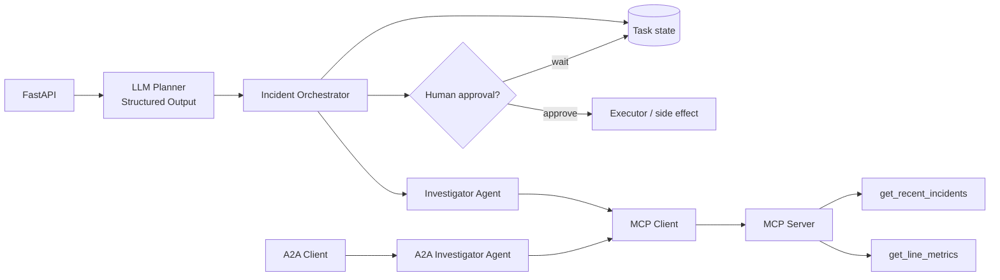

# ChampionAI Agent Platform

**Runnable async Python engineering lab for a manufacturing incident agent platform.**

Built to demonstrate the software-engineering patterns behind reliable agentic systems — not just a chatbot demo.

## What this project demonstrates

| Area | Implementation |
|---|---|
| **API** | FastAPI |
| **Typed contracts** | Pydantic |
| **Async execution** | Python `asyncio` / parallel evidence collection |
| **LLM planning** | OpenAI Structured Outputs |
| **Agent → tools** | MCP client/server |
| **Agent → agent** | A2A Agent Card, task lifecycle, artifacts |
| **Orchestration** | Planner → Investigator → Executor |
| **Safety** | Human approval gate before side effects |
| **Reliability** | retries, exponential backoff, idempotency, duplicate-action protection |
| **State** | in-memory store for deterministic tests + PostgreSQL store |
| **Agent quality** | pytest + DeepEval behavioral evaluation |
| **Scope control** | XML-structured system prompt + no-tool behavior for out-of-scope requests |
| **Rollout patterns** | LaunchDarkly SDK lab for prompt/behavior versioning |

## Architecture



## Reliability model

The project intentionally separates **reasoning** from **authority**.

The model may decide how to investigate, but deterministic software owns:

- task identity
- idempotency
- action claims
- approval state
- side-effect execution
- persisted task state

### Duplicate side-effect protection

A deterministic action ID is derived from task/action identity. The store must grant the claim only once before the external effect is executed.

This lets multiple callers safely converge on a single business action.

### Retry behavior

Transient tool failures use bounded retries with exponential backoff and jitter. Permanent failures remain visible rather than being silently hidden.

### Human approval

The executor prepares the action, but the maintenance-ticket side effect is gated by explicit human approval.

## MCP: agent-to-tool boundary

The Investigator obtains evidence through an MCP client instead of directly importing the tool implementation.

Tools expose structured outputs for:

- current line metrics
- recent matching incidents

This keeps the agent/tool contract explicit and transportable.

## A2A: agent-to-agent boundary

A remote Investigator agent exposes:

- an Agent Card
- discoverable skills
- task state
- progress messages
- structured artifacts

The client discovers the remote agent and receives the investigation result through the A2A task lifecycle.

**Mental model:**

- **MCP:** agent → tools/resources
- **A2A:** agent → another agent

## LLM Structured Outputs

The runtime Planner uses a typed Pydantic output contract so planning is machine-validatable before orchestration proceeds.

The deterministic Planner remains available for repeatable unit tests.

## Agent evaluation

The project separates deterministic tests from behavioral AI evaluation:

- `pytest` validates orchestration, retries, idempotency, and duplicate approval behavior
- `DeepEval` validates agent behavior such as scope enforcement and tool selection

## Scope enforcement

A structured system prompt defines:

- role
- allowed domain
- forbidden domain
- delegation rules
- tool-selection policy
- out-of-scope behavior

Out-of-scope requests must select `tool=none`.

## Selected files

```text
app/
├── api.py
├── domain.py
├── agents.py
├── orchestrator.py
├── reliability.py
├── store.py
├── postgres_store.py
├── llm_planner.py
├── mcp_server.py
├── mcp_tools_client.py
├── a2a_server.py
├── qad_scope_agent.py
└── launchdarkly_lab.py

tests/
└── test_orchestrator.py

evals/
└── test_qad_agent_eval.py
```

## Run locally

### 1. Create an environment

```bash
python -m venv .venv
```

Activate it and install the project:

```bash
python -m pip install -e ".[dev]"
```

### 2. Configure environment

Create `.env` locally:

```text
OPENAI_API_KEY=<your-key>
OPENAI_MODEL=gpt-5.6-luna
```

Never commit `.env`.

### 3. Run deterministic tests

```bash
pytest tests/test_orchestrator.py -v
```

### 4. Run the API

```bash
uvicorn app.api:app --reload
```

## Engineering intent

This repository is deliberately small enough to review quickly.

The goal is to make the engineering signals obvious:

**typed contracts · async execution · agent/tool boundaries · agent/agent boundaries · durable authority · idempotency · HITL · behavioral evaluation**

It is a hands-on engineering lab, not a claim that this manufacturing system is deployed in production.

---

**Mauricio Alfonso Cano**  
Applied AI & Agentic Systems Engineer  
[LinkedIn](https://www.linkedin.com/in/mauricio-alfonso-cano-ai/) · [GitHub](https://github.com/mauricio-cano-ai)

